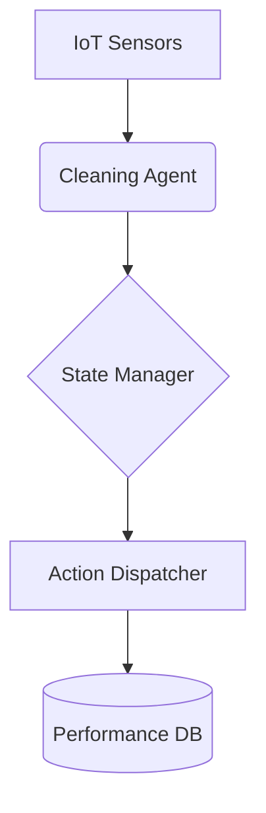

# System Architecture

## Components
1. **IoT Sensors** - Provide real-time home data
2. **Cleaning Agent** - Core decision-making logic
3. **State Manager** - Maintains system state
4. **Action Dispatcher** - Executes commands
5. **Performance DB** - Stores metrics and logs